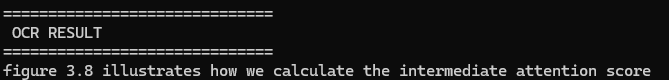
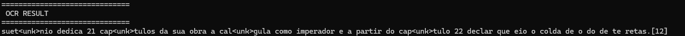

# GlyphNet-CRNN-1D
*A custom end-to-end OCR pipeline built with CNN + BiLSTM + CTC*

This repository contains a structured OCR project built using deep learning.
The goal was to design, train, and evaluate a custom end-to-end OCR system using a CRNN-based architecture (CNN + BiLSTM + CTC).

## 🎯 Project Goals
- Build a complete OCR pipeline from scratch
- Design and generate custom datasets (real + synthetic)
- Experiment with different hyperparameter combinations
- Implement structured training workflow
- Integrate experiment tracking (MLflow)
- Analyze architectural limitations and model bottlenecks

## 🎯 Architecture Overview
The model follows a CRNN-style architecture:

### Image
→ CNN feature extractor  
→ Feature map reshaping (sequence along width)  
→ BiLSTM  
→ MLP projection  
→ CTC Loss

### Key design decisions:

- Fixed image height (64px)
- Variable width (512 → later increased to 1024)
- Character-level recognition
- Custom charset including accented characters

## 📊 Data Strategy
### Phase 1 – Real Text Collection
To build a structured dataset, I implemented a crawler targeting:

- Wikipedia
- Wikisource

The idea was to collect diverse text samples for synthetic rendering.

Since semantic meaning was not required, the objective was purely character extraction.

### Phase 2 – Synthetic Data Generation

A synthetic generator was implemented to:

- Render text images
- Control font styles
- Simulate various text lengths
- Introduce structured variability

Later, a second dataset version (v2) was created with:

- Increased difficulty
- Wider images (1024px)
- More complex text patterns
- Additional layout diversity

Final combined dataset size: ~560k samples.

## ⚙️ Training Pipeline

The training pipeline included:

- Checkpoint saving and resume support
- Early stopping (patience-based)
- Grid search using smaller dataset subsets
- Automatic hyperparameter combination generation
- MLflow integration for experiment tracking
- Batch size experimentation (8 → 16)
- Learning rate tuning
- Fine-tuning from previous checkpoints

This project focused heavily on controlled experimentation rather than blind training.

## 🔬 Iterative Improvements

Throughout development, I:
- Increased image width from 512 to 1024
- Expanded dataset diversity
- Reduced learning rate for fine-tuning stability
- Adjusted batch size
- Merged old and new datasets
- Performed architectural adjustments within CRNN limits

The system improved significantly in:

- Single-line text recognition
- High-contrast scenarios (white background / black text)
- Longer sequence handling

## 🚧 Architectural Limitations Identified

Despite improvements, structural limitations emerged:

### 1️⃣ Accented Characters (ç, ã, é, etc.)

The model struggled with:

- Diacritics
- Small vertical features
- Subtle character variations

Likely causes:

- Limited vertical resolution (64px height)
- Multiple vertical downsampling layers in CNN
- Information loss of small high-frequency details

This exposed a resolution bottleneck in the architecture.

### 2️⃣ Multi-line Text

The model presented significant difficulty with multi-line inputs.

Reason:

The CRNN + CTC approach linearizes spatial information along width, effectively converting a 2D layout into a 1D sequence. While effective for single-line text, this architecture is inherently limited for multi-line layout modeling.

This is not a dataset problem — it is an architectural constraint.

## 📈 Results
Where the model performs well:

- Single-line text
- Clean backgrounds
- High contrast images
- Long horizontal sequences

*Original*  
  
*Output*  

Where the model struggles:

- Accented characters
- "ç"
- Multi-line layout
- Reduced vertical detail

*Original*  
  
*Output*  

## 🔄 Conclusion

After reaching ~60+ epochs in total, it became clear that:
- The remaining issues are architectural, not parametric.
- Fixing accented character recognition would require vertical resolution changes.
- Proper multi-line handling requires a different modeling strategy.